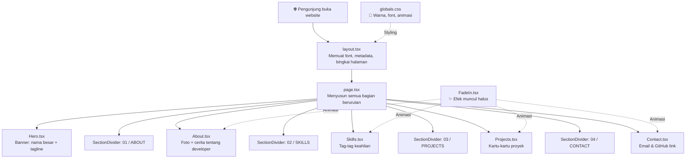

# 📖 Penjelasan Lengkap Project Portfolio

> Project ini adalah **website portfolio pribadi** (semacam CV online) yang dibuat menggunakan **Next.js** (framework untuk membuat website modern). Website-nya bertema **gelap/dark** dengan desain yang minimalis tapi elegan.

---

## 🗂️ Gambaran Besar Struktur File

```
portfolio/
├── .claude/               ← Pengaturan untuk AI Claude Code
├── .git/                  ← Riwayat perubahan file (version control)
├── .next/                 ← File hasil "kompilasi" otomatis (jangan diubah)
├── node_modules/          ← Semua "pustaka/library" yang dipakai (jangan diubah)
├── public/                ← Gambar dan aset yang bisa diakses langsung
├── src/                   ← ⭐ KODE UTAMA — inilah isi website-nya
│   ├── app/               ← Halaman-halaman website
│   └── components/        ← Potongan-potongan tampilan yang bisa dipakai ulang
├── package.json           ← Daftar "bahan-bahan" project
├── tsconfig.json          ← Pengaturan bahasa TypeScript
├── next.config.ts         ← Pengaturan framework Next.js
├── eslint.config.mjs      ← Pengaturan pemeriksa kualitas kode
├── postcss.config.mjs     ← Pengaturan pemroses CSS/styling
├── .gitignore             ← Daftar file yang tidak perlu disimpan di Git
├── pnpm-lock.yaml         ← Catatan versi pasti setiap pustaka
├── pnpm-workspace.yaml    ← Pengaturan PNPM workspace
├── next-env.d.ts          ← File otomatis dari Next.js (jangan diubah)
├── SPEC.md                ← Dokumen "cetak biru" desain website
└── README.md              ← Panduan cara menjalankan project
```

---

## 📁 FILE-FILE KONFIGURASI (Pengaturan)

File-file ini seperti **"buku aturan"** yang memberitahu komputer cara menjalankan project ini. Kamu biasanya tidak perlu mengubah file-file ini kecuali ingin menambah fitur baru.

---

### 📄 `package.json`
**Fungsi:** Ini seperti **daftar belanjaan** project. Berisi:
- **Nama project** → `"portfolio"`
- **Perintah-perintah** yang bisa dijalankan:
  - `pnpm dev` → Menjalankan website di komputer sendiri untuk testing
  - `pnpm build` → Membungkus website agar siap dipublish online
  - `pnpm start` → Menjalankan versi yang sudah dibungkus
  - `pnpm lint` → Memeriksa apakah ada kesalahan penulisan kode
- **Daftar pustaka (library)** yang dipakai:
  - `next` → Framework utama untuk membuat website
  - `react` → Library untuk membuat tampilan interaktif
  - `react-dom` → Penghubung antara React dan halaman web
  - `tailwindcss` → Library untuk mempermudah styling/desain
  - `typescript` → Bahasa pemrograman (versi JavaScript yang lebih ketat)
  - `eslint` → Pemeriksa kualitas kode

**Analogi:** Bayangkan ini seperti **resep masakan** — daftarnya bahan (dependencies) dan langkah-langkahnya (scripts).

---

### 📄 `next.config.ts`
**Fungsi:** File pengaturan untuk **Next.js** (framework website-nya).

```ts
import type { NextConfig } from "next";
const nextConfig: NextConfig = {
  /* config options here */
};
export default nextConfig;
```

**Penjelasan baris per baris:**
- `import type { NextConfig }` → Mengambil "template aturan" dari Next.js
- `const nextConfig: NextConfig = {}` → Membuat pengaturan (saat ini masih kosong, artinya pakai semua pengaturan bawaan)
- `export default nextConfig` → "Mengeluarkan" pengaturan ini agar bisa dipakai oleh sistem

**Analogi:** Seperti **lembar pengaturan di remote TV** — saat ini semua masih pakai pengaturan pabrik.

---

### 📄 `tsconfig.json`
**Fungsi:** Mengatur cara **TypeScript** (bahasa pemrograman yang dipakai) bekerja.

Hal-hal penting di dalamnya:
- `"target": "ES2017"` → Kode akan diterjemahkan ke standar JavaScript tahun 2017 (agar kompatibel dengan banyak browser)
- `"strict": true` → Mode ketat — TypeScript akan sangat teliti memeriksa kesalahan
- `"jsx": "react-jsx"` → Mengizinkan penulisan HTML di dalam JavaScript (ini yang bikin React bisa bekerja)
- `"paths": { "@/*": ["./src/*"] }` → Membuat jalan pintas: daripada menulis `../../src/components`, cukup tulis `@/components`

**Analogi:** Seperti **aturan tata bahasa** dalam menulis — semakin ketat aturannya, semakin sedikit kesalahan.

---

### 📄 `eslint.config.mjs`
**Fungsi:** Pengaturan **ESLint** — alat yang memeriksa kualitas kode secara otomatis.

```js
import nextVitals from "eslint-config-next/core-web-vitals";
import nextTs from "eslint-config-next/typescript";
```

Ini menggunakan aturan pemeriksaan bawaan dari Next.js untuk memastikan kode mengikuti *best practice* (cara terbaik).

**Analogi:** Seperti **pemeriksa ejaan di Microsoft Word** — menandai kalau ada yang salah.

---

### 📄 `postcss.config.mjs`
**Fungsi:** Mengatur **PostCSS** — alat yang memproses file CSS (styling/desain).

```js
const config = {
  plugins: {
    "@tailwindcss/postcss": {},  // Mengaktifkan Tailwind CSS
  },
};
```

Ini cuma bilang: "Hei, tolong proses CSS-nya pakai Tailwind ya."

**Analogi:** Seperti **mesin cuci** yang secara otomatis memproses baju (CSS) dengan detergen tertentu (Tailwind).

---

### 📄 `.gitignore`
**Fungsi:** Daftar file/folder yang **TIDAK perlu disimpan** ke Git (sistem version control).

Yang di-ignore antara lain:
- `node_modules/` → Pustaka yang diunduh (bisa diunduh ulang kapan saja)
- `.next/` → File hasil kompilasi (otomatis dibuat ulang)
- `.env*` → File rahasia (password, API key, dll.)

**Analogi:** Seperti **daftar barang yang tidak perlu dibawa pindahan** — kalau sudah bisa dibeli lagi di tempat baru, tidak usah dibawa.

---

### 📄 `pnpm-lock.yaml`
**Fungsi:** Catatan **versi pasti** dari setiap pustaka yang dipakai.

File ini dibuat otomatis oleh `pnpm` (package manager). Gunanya supaya kalau orang lain download project ini, mereka mendapat **pustaka yang persis sama** versinya.

**Analogi:** Seperti **nomor lot** di obat — memastikan semua orang dapat obat dari batch yang sama.

---

### 📄 `pnpm-workspace.yaml`
**Fungsi:** Pengaturan kecil untuk PNPM workspace.

```yaml
ignoredBuiltDependencies:
  - sharp
  - unrs-resolver
```

Hanya bilang: "Abaikan proses build untuk pustaka `sharp` dan `unrs-resolver`" (karena tidak dipakai aktif).

---

### 📄 `next-env.d.ts`
**Fungsi:** File yang **dibuat otomatis** oleh Next.js. Memberitahu TypeScript tentang tipe-tipe data khusus Next.js. **Jangan diubah manual.**

---

### 📄 `.claude/settings.local.json`
**Fungsi:** Pengaturan untuk **Claude Code** (AI agent yang membuat project ini).

```json
{
  "permissions": {
    "allow": ["Bash(pnpm tsc *)"]
  }
}
```

Artinya: Claude Code diizinkan menjalankan perintah `pnpm tsc` (kompilasi TypeScript) tanpa perlu minta izin.

---

## 📝 FILE-FILE DOKUMENTASI

---

### 📄 `README.md`
**Fungsi:** **Panduan cara menjalankan project.** Berisi instruksi standar dari Next.js — cara menjalankan server development, link-link belajar, dan cara deploy ke Vercel.

---

### 📄 `SPEC.md`
**Fungsi:** Ini adalah **"cetak biru" / blueprint** website. Dokumen ini berisi:
- 🎯 **Tujuan project** → Portfolio pribadi untuk developer bernama "Bene"
- 🛠️ **Teknologi yang dipakai** → Next.js, TypeScript, Tailwind CSS, pnpm
- 📐 **Struktur halaman** → Hero, About, Skills, Projects, Contact
- 🎨 **Panduan desain** → Warna gelap, font Geist Sans, garis-garis editorial
- 📋 **Fase pembangunan** → Dari skeleton → styling → polish → deploy
- 🤖 **Aturan untuk AI** → Petunjuk agar Claude Code konsisten dalam membuat kode

**Analogi:** Ini seperti **gambar arsitek sebelum membangun rumah** — semua sudah direncanakan sebelum mulai coding.

---

## ⭐ FILE-FILE SOURCE CODE UTAMA (Kode Website)

Ini adalah file-file yang **benar-benar menjadi isi website**. Dibagi jadi dua folder:
- `src/app/` → **Halaman dan pengaturan global**
- `src/components/` → **Potongan-potongan tampilan** yang dipakai di halaman

---

### 📄 `src/app/globals.css` — Pengaturan Gaya Global

**Fungsi:** File ini mengatur **warna, font, dan animasi** yang berlaku di seluruh website.

```css
@import "tailwindcss";
```
→ Mengaktifkan Tailwind CSS (framework styling).

```css
@theme inline {
  --color-accent: #003cff;       /* Warna biru — warna "brand" utama */
  --color-bg: #0a0a0a;           /* Warna background — hampir hitam */
  --color-fg: #fafafa;           /* Warna teks utama — putih susu */
  --color-fg-muted: #a1a1aa;     /* Warna teks redup — abu-abu */
  --color-border: #27272a;       /* Warna garis pemisah — abu gelap */
  --font-sans: var(--font-geist-sans);  /* Font: Geist Sans */
}
```
→ Ini mendefinisikan **"variabel warna"**. Bayangkan seperti cat dinding — kamu cukup ganti satu warna di sini, dan seluruh website berubah sekaligus!

```css
body {
  background-color: var(--color-bg);  /* Background pakai warna --color-bg */
  color: var(--color-fg);             /* Teks pakai warna --color-fg */
  font-family: var(--font-sans);      /* Font pakai Geist Sans */
}
```
→ Mengatur tampilan dasar `body` (seluruh halaman).

```css
@keyframes fade-up { ... }
.anim-fade-up { ... }
```
→ Animasi **"muncul dari bawah"** — elemen perlahan naik dan muncul. Durasi 0.7 detik.

**Analogi:** File ini seperti **buku panduan warna dan gaya** untuk seorang pelukis.

---

### 📄 `src/app/layout.tsx` — Kerangka Utama Website

**Fungsi:** File ini adalah **"bingkai" yang membungkus semua halaman**. Apa yang ada di sini akan muncul di SETIAP halaman.

```tsx
import { Geist } from "next/font/google";
```
→ Mengunduh font **Geist Sans** dari Google Fonts.

```tsx
const geist = Geist({
  variable: "--font-geist-sans",
  subsets: ["latin"],
});
```
→ Menyiapkan font tersebut dan menyimpannya dalam variabel `--font-geist-sans`.

```tsx
export const metadata: Metadata = {
  title: "Bene — Web Developer",
  description: "Junior web developer building internal tools...",
  openGraph: { ... },
};
```
→ **Metadata / informasi halaman** — ini yang muncul di tab browser, hasil pencarian Google, dan saat di-share di media sosial.

```tsx
export default function RootLayout({ children }) {
  return (
    <html lang="en" className={`${geist.variable} antialiased`}>
      <body className="min-h-screen bg-bg text-fg">{children}</body>
    </html>
  );
}
```
→ Membuat struktur HTML dasar:
- `<html>` → Tag paling luar, bahasa diset ke bahasa Inggris
- `antialiased` → Membuat teks terlihat lebih halus
- `<body>` → Tinggi minimal sepenuh layar, background gelap, teks terang
- `{children}` → Tempat di mana halaman-halaman lain akan disisipkan

**Analogi:** Seperti **bingkai foto** — foto-fotonya (halaman) bisa berganti, tapi bingkainya tetap sama.

---

### 📄 `src/app/page.tsx` — Halaman Utama (Home)

**Fungsi:** Ini adalah **halaman yang muncul pertama kali** saat website dibuka (halaman beranda).

```tsx
import Hero from "@/components/Hero";
import About from "@/components/About";
// ... dst
```
→ Mengambil semua **komponen/bagian** yang akan ditampilkan.

```tsx
export default function Home() {
  return (
    <main className="relative">
      {/* Garis vertikal di sisi kiri-kanan (dekorasi editorial) */}
      <div aria-hidden="true" className="fixed inset-y-0 ...">
        <div className="... border-l border-r border-border/30" />
      </div>

      <Hero />                                          {/* Bagian pembuka */}
      <SectionDivider number="01" label="About" />      {/* Garis pemisah */}
      <About />                                         {/* Tentang Bene */}
      <SectionDivider number="02" label="Skills & Tech" />
      <Skills />                                        {/* Keahlian */}
      <SectionDivider number="03" label="Featured Projects" />
      <Projects />                                      {/* Proyek */}
      <SectionDivider number="04" label="Contact" />
      <Contact />                                       {/* Kontak */}
    </main>
  );
}
```

**Yang terjadi:**
1. Membuat **dua garis vertikal tipis** di sisi kiri-kanan layar (dekorasi, tidak bisa diklik)
2. Menyusun semua bagian website secara berurutan dari atas ke bawah
3. Antara setiap bagian, ada **garis pemisah** dengan nomor dan label

**Analogi:** Seperti **daftar isi buku** — menyusun bab-bab secara berurutan.

---

## 🧩 KOMPONEN-KOMPONEN (Potongan Tampilan)

Komponen itu seperti **"blok LEGO"** — potongan kecil yang bisa disusun dan dipakai ulang.

---

### 📄 `src/components/Hero.tsx` — Bagian Pembuka / "Banner Utama"

**Fungsi:** Tampilan pertama yang dilihat pengunjung — **nama besar dan perkenalan singkat**.

**Apa yang ditampilkan:**
1. **Dua label kecil berbentuk pil (pill tags)**:
   - ".NET Specialist" (border abu-abu)
   - "Exploring Next.js" (border biru/accent)
2. **Judul BESAR**: "Building Things With Code."
3. **Paragraf perkenalan**: "Hi, I'm **Bene**. I build internal tools..."

**Syntax penting:**
- `className="text-5xl md:text-7xl lg:text-8xl"` → Ukuran teks yang **responsif**:
  - Di HP (`text-5xl`) → Besar
  - Di tablet (`md:text-7xl`) → Lebih besar
  - Di desktop (`lg:text-8xl`) → Paling besar
- `anim-fade-up` → Animasi muncul dari bawah
- `style={{ animationDelay: "200ms" }}` → Menunda animasi 200 milidetik agar elemen muncul bertahap
- `<span className="text-accent">Bene</span>` → Nama "Bene" ditampilkan dalam warna biru (accent)

**Analogi:** Seperti **halaman depan majalah** — judul besar, tagline menarik.

---

### 📄 `src/components/About.tsx` — Bagian "Tentang Saya"

**Fungsi:** Menampilkan **foto dan cerita tentang developer**.

**Layout:** Dua kolom (di desktop):
- **Kiri:** Foto placeholder (saat ini hanya kotak abu-abu dengan huruf "B" besar, karena foto asli belum dipasang)
- **Kanan:** Teks perkenalan

**Syntax penting:**
- `grid md:grid-cols-2` → Di layar besar, bagi jadi **2 kolom**. Di HP, tetap 1 kolom (menumpuk vertikal).
- **Corner brackets** (hiasan sudut):
  ```tsx
  <div className="absolute top-0 left-0 w-5 h-5 border-t border-l border-border/60" />
  ```
  → Membuat dekorasi garis kecil di **4 sudut** foto — ini memberikan kesan elegan tanpa border penuh.
- `<FadeIn>` → Membungkus konten agar muncul dengan **animasi fade** saat di-scroll.

**Analogi:** Seperti **halaman "About Me"** di LinkedIn.

---

### 📄 `src/components/Skills.tsx` — Bagian Keahlian

**Fungsi:** Menampilkan **daftar teknologi/keahlian** dalam bentuk "tag/label kecil".

**Data yang ditampilkan:**
```tsx
const daily = ["ASP.NET MVC", "C#", "SQL Server", "IIS", "Cloudflare Tunnel", "Git"];
const exploring = ["Next.js", "TypeScript", "Tailwind CSS", "React"];
```

**Layout:** Dua kolom:
- **"Daily"** (dipakai sehari-hari) → Tag abu-abu biasa
- **"Exploring"** (sedang dipelajari) → Tag biru (accent) — menandakan ini hal baru yang sedang dijelajahi

**Syntax penting:**
- `{daily.map((skill) => (...))}` → Ini adalah **loop/perulangan**. Daripada menulis 6 tag satu per satu, kode ini otomatis membuat tag untuk setiap item di daftar `daily`.
- `key={skill}` → ID unik agar React bisa membedakan setiap tag.
- `sr-only` → "Screen reader only" — teks yang tersembunyi secara visual tapi bisa dibaca oleh software pembaca layar (untuk aksesibilitas difabel).

**Analogi:** Seperti **daftar keahlian di CV** — dikelompokkan berdasarkan tingkat penguasaan.

---

### 📄 `src/components/Projects.tsx` — Bagian Proyek

**Fungsi:** Menampilkan **kartu-kartu proyek** yang pernah dikerjakan.

**Data proyek (saat ini masih placeholder):**
```tsx
const projects = [
  {
    title: "Project One",
    description: "Short description...",
    tags: ["ASP.NET MVC", "SQL Server", "IIS"],
  },
  {
    title: "Project Two",
    description: "Short description...",
    tags: ["Next.js", "TypeScript", "Tailwind"],
  },
];
```

**Apa yang ditampilkan:**
1. **Kartu proyek** dengan judul, deskripsi singkat, dan tag teknologi
2. **Link "View all projects →"** di bawah

**Syntax penting:**
- `group` dan `group-hover:` → Fitur Tailwind yang memungkinkan **efek hover pada anak element**. Saat mouse hover di kartu (group), sudut-sudut (corner brackets) berubah warna dari abu ke biru.
- `projects.map((project, i) => ...)` → Loop yang membuat kartu untuk setiap proyek. `i` adalah nomor urut (0, 1, 2...).
- `delay={i * 120}` → Setiap kartu muncul dengan **jeda 120ms** — kartu pertama muncul duluan, lalu kartu kedua, dst.
- `hover:bg-zinc-900/60` → Saat mouse hover, background kartu jadi **sedikit lebih terang**.

**Analogi:** Seperti **galeri portofolio** — setiap kartu adalah satu pameran mini.

---

### 📄 `src/components/Contact.tsx` — Bagian Kontak

**Fungsi:** Menampilkan **cara menghubungi** si developer.

**Apa yang ditampilkan:**
1. Judul: "Want to chat? I'm a few clicks away."
2. Dua tombol:
   - **"Email me"** → Membuka aplikasi email
   - **"GitHub"** → Membuka profil GitHub

**Syntax penting:**
- `href="mailto:your@email.com"` → Saat diklik, otomatis membuka aplikasi email dengan alamat terisi.
- `target="_blank"` → Membuka link di **tab baru**.
- `rel="noopener noreferrer"` → Pengamanan keamanan saat membuka link di tab baru.
- `hover:border-accent hover:text-accent` → Saat mouse hover, border dan teks berubah jadi **warna biru**.

**Catatan:** Email dan username GitHub masih **placeholder** (`your@email.com`, `yourusername`) — perlu diganti dengan data asli.

**Analogi:** Seperti **kartu nama digital**.

---

### 📄 `src/components/FadeIn.tsx` — Komponen Animasi Muncul

**Fungsi:** Komponen pembungkus yang membuat elemen **muncul secara halus (fade in)** saat di-scroll ke posisinya.

```tsx
"use client";
```
→ Menandai bahwa komponen ini berjalan di **browser/client** (bukan di server). Ini diperlukan karena komponen ini menggunakan fitur-fitur interaktif.

**Cara kerja:**
1. **Mendeteksi scroll** — menggunakan `IntersectionObserver` (API browser untuk mengetahui apakah suatu elemen sudah terlihat di layar)
2. **Saat elemen terlihat** (15% dari elemen masuk layar) → teks/gambar berubah dari **transparan** menjadi **terlihat**, dan bergerak sedikit **dari bawah ke atas**
3. **Hanya terjadi sekali** — setelah muncul, observer dimatikan (`disconnect`)

**Parameter:**
- `delay` → Berapa milidetik penundaan sebelum muncul (default: 0)
- `children` → Konten yang dibungkus (bisa apa saja: teks, gambar, kartu, dll.)

**Syntax penting:**
- `useRef` → Cara React untuk "menunjuk" elemen tertentu di halaman (seperti menandai dengan stiker)
- `useState` → Menyimpan status: apakah elemen sudah terlihat atau belum (`true`/`false`)
- `useEffect` → Menjalankan kode **setelah komponen muncul** di halaman
- `threshold: 0.15` → Animasi dimulai saat **15%** dari elemen terlihat di layar

**Analogi:** Seperti **efek "reveal" di presentasi PowerPoint** — konten muncul satu per satu saat kamu scroll.

---

### 📄 `src/components/SectionDivider.tsx` — Garis Pemisah Antar Bagian

**Fungsi:** Membuat **garis horizontal tipis** dengan label bernomor di antara setiap bagian (section).

Contoh tampilan:
```
──────── 01 / ABOUT ────────
```

**Parameter:**
- `number` → Nomor bagian (misalnya "01", "02", dst.)
- `label` → Nama bagian (misalnya "About", "Skills & Tech")

**Syntax penting:**
- `border-t border-border/50` → Garis horizontal tipis, warna abu-abu dengan transparansi 50%
- `font-mono` → Nomor ditampilkan dalam **font monospace** (seperti font di terminal/code editor)
- `text-accent` → Label ditampilkan dalam **warna biru (accent)**
- `uppercase tracking-[0.12em]` → Huruf **kapital semua** dengan jarak antar huruf yang agak lebar (untuk kesan editorial)

**Analogi:** Seperti **tab pembatas** di binder/map — memisahkan bagian-bagian dengan label yang jelas.

---

## 📁 FOLDER `public/`

Berisi **gambar-gambar bawaan** dari Next.js (belum diganti dengan gambar asli):
- `file.svg` → Ikon file
- `globe.svg` → Ikon bola dunia
- `next.svg` → Logo Next.js
- `vercel.svg` → Logo Vercel
- `window.svg` → Ikon jendela

Gambar-gambar ini **belum dipakai** di website saat ini (masih sisa dari template bawaan Next.js).

---

## 🔑 Ringkasan: Alur Kerja Website



---

## 📊 Status Project

| Fase | Status |
|---|---|
| Phase 1: Skeleton (kerangka) | ✅ Selesai |
| Phase 2: Layout & Styling | ✅ Selesai |
| Phase 3: Polish (animasi, responsif, SEO) | ⏳ Berikutnya |
| Phase 4: Deploy ke internet | ⏳ Belum |
| Phase 5: Isi konten asli | ⏳ Belum |

> [!IMPORTANT]
> Beberapa hal yang **masih perlu diganti** dengan data asli:
> - Email: `your@email.com` → email kamu yang sebenarnya
> - GitHub: `yourusername` → username GitHub kamu
> - Foto: masih placeholder huruf "B" → perlu ditambahkan foto asli
> - Proyek: "Project One" dan "Project Two" → perlu diisi proyek nyata
